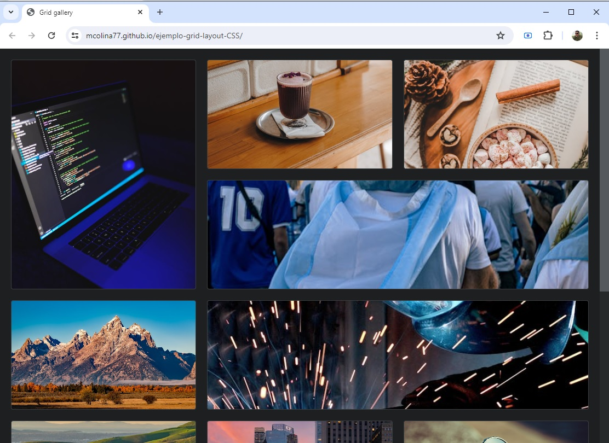

# ejemplo-grid-layout-CSS
galería de imágenes con grid-layout de CSS

Si quieres ver el resultado de cómo quedó la página. Puedes hacer clic **[aquí](https://mcolina77.github.io/ejemplo-grid-layout-CSS/)**
